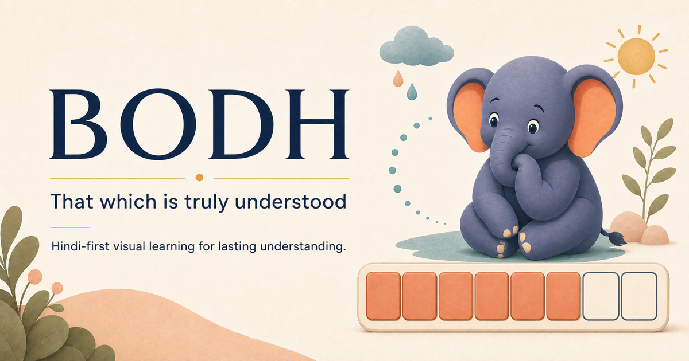
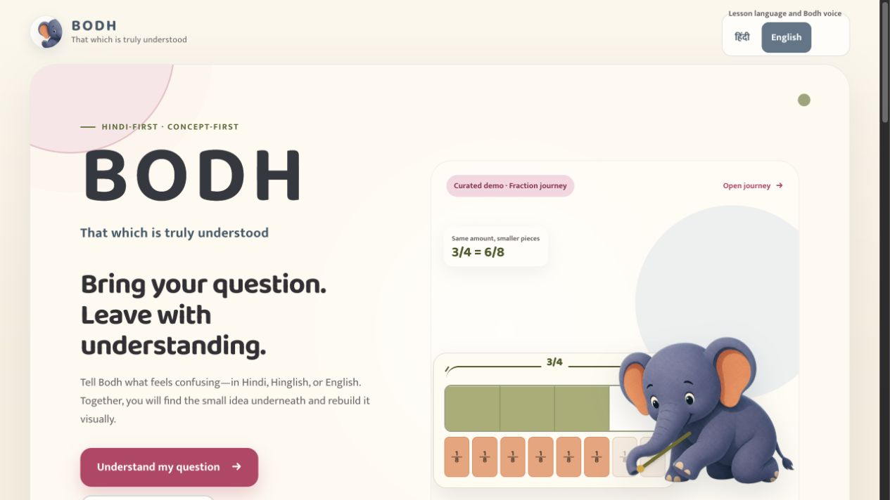
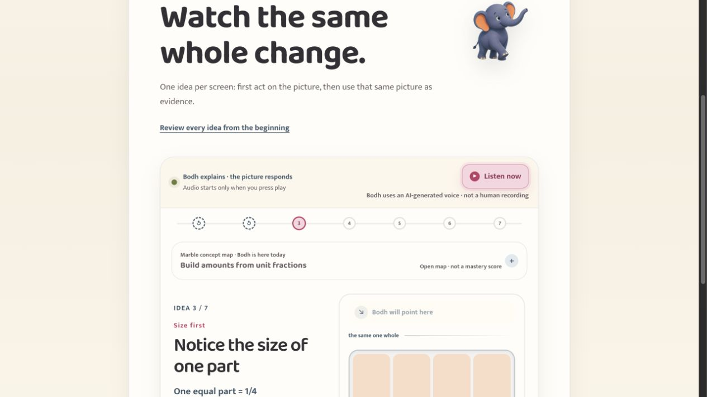
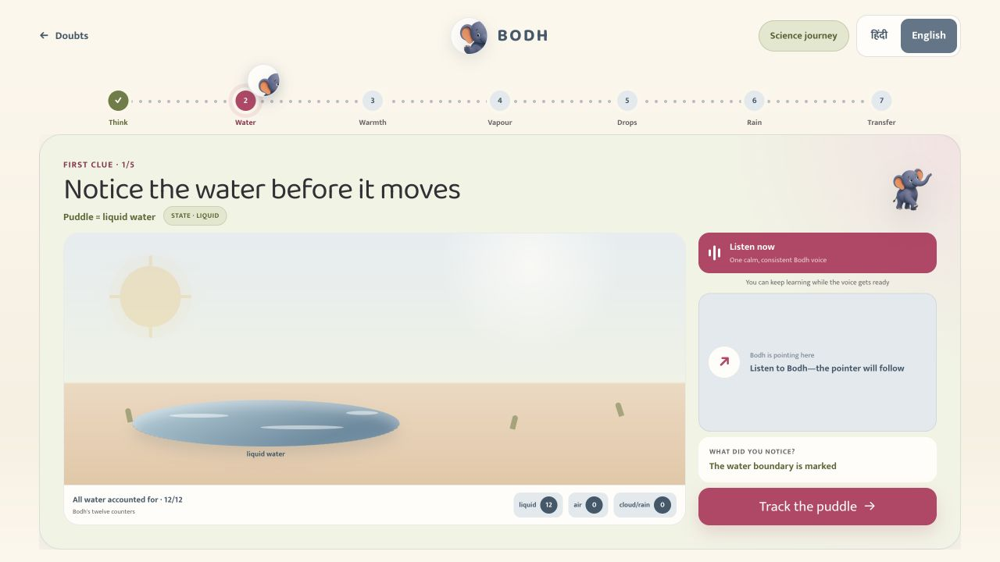
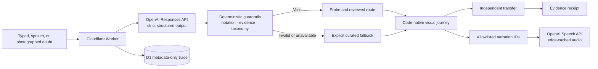

<p align="center">
  
</p>

<h1 align="center">BODH</h1>

<p align="center"><strong>That which is truly understood.</strong></p>

<p align="center">
  A Hindi-first visual misconception tutor for children aged 8–12.<br />
  Bring a doubt. Find the idea underneath. Leave with understanding.
</p>

<p align="center">
  <a href="https://bodh-learning.neekhil007.chatgpt.site"><strong>Launch Bodh →</strong></a>
  &nbsp;·&nbsp;
  <a href="https://bodh-learning.neekhil007.chatgpt.site/judge-tour">90-second judge journey</a>
  &nbsp;·&nbsp;
  <a href="https://bodh-learning.neekhil007.chatgpt.site/how-it-works">How it works</a>
</p>

<p align="center">
  
  
  
  
  
</p>

<p align="center">
  
</p>

## Why Bodh exists

A child can remember a rule and still not understand the idea that makes it true. Translating the rule does not repair that bottleneck, and immediately showing the answer can hide it.

Bodh takes a different route:

```text
doubt → listen → probe → rebuild one atomic idea visually → transfer → return
```

The learner can speak or type in Hindi, Hinglish, or English. Bodh preserves the original question, asks one small question before teaching, and then turns the underlying concept into something the child can see and manipulate. A fresh transfer task checks whether the idea travels beyond the example. Only then does the learner return to the original doubt.

This repository contains two complete cross-subject proofs:

- **Mathematics:** understand `3/4 ÷ 1/8` by rebuilding wholes, unit fractions, equivalent partitions, multiplication, and division as counting.
- **Science:** follow water from a puddle through warming, invisible vapour, condensation, rain, and a new cold-lid experiment.



## The fastest way to experience it

Open the **[guided judge journey](https://bodh-learning.neekhil007.chatgpt.site/judge-tour)**. It keeps the full argument inside one deliberate storyline so an evaluator does not have to hunt through the app.

| Beat | What the judge sees | Why it matters |
|---|---|---|
| 1. Promise | A Hindi-first, concept-first learner experience | Language access without turning the product into a translation layer |
| 2. Mathematics | One whole is repartitioned until `3/4 = 6/8` becomes visible | The rule emerges from the model instead of being announced |
| 3. Science | A puddle doubt receives one bounded live diagnosis | One real OpenAI call, with a clearly labelled reviewed fallback |
| 4. Transfer | The learner predicts what happens under a cold lid | Understanding has to travel to a new situation |
| 5. Complete | A shared evidence receipt records the journey | A visible ending for the child and a parent-friendly artifact |

The standalone **[fraction journey](https://bodh-learning.neekhil007.chatgpt.site/demo)** and **[evaporation journey](https://bodh-learning.neekhil007.chatgpt.site/science/evaporation)** remain available for deeper exploration.

<table>
  <tr>
    <td width="50%"></td>
    <td width="50%"></td>
  </tr>
  <tr>
    <td align="center"><strong>Mathematics</strong><br />Seven atomic ideas, synchronized narration, fraction bars, and a number line.</td>
    <td align="center"><strong>Science</strong><br />Five concept screens bracketed by a probe and an independent transfer.</td>
  </tr>
</table>

## One mentor, three roles

Bodh is not a scorekeeper. The elephant stays emotionally steady while the learning role changes.

<table>
  <tr>
    <td align="center" width="33%"></td>
    <td align="center" width="33%"></td>
    <td align="center" width="33%"></td>
  </tr>
  <tr>
    <td align="center"><strong>The Listener</strong><br />Hears the doubt without grading the child.</td>
    <td align="center"><strong>The Pathfinder</strong><br />Finds the smallest useful prerequisite.</td>
    <td align="center"><strong>The Gentle Tinkerer</strong><br />Moves the picture and lets the child notice.</td>
  </tr>
</table>

## What is built

| Surface | Current implementation |
|---|---|
| Doubt intake | Nine selectable reviewed doubts—eight mathematics and one science—plus editable typed or browser-transcribed input |
| Language | Complete Hindi and English interface paths; speech recognition uses `hi-IN` or `en-IN` when the browser supports it |
| Context | Optional PNG, JPEG, or WebP homework image up to 4 MiB |
| Diagnosis | One OpenAI Responses API call with strict structured output and bounded curriculum IDs |
| Teaching | Code-native visual artifacts; the model never generates executable UI |
| Mathematics | Seven atomic concept beats, fraction bars, number line, transfer, return, and evidence receipt |
| Science | Fixed-screen water journey with a clean concept path, conservation counters, transfer, and the same receipt language |
| Voice | Authored Hindi and Indian-English narration IDs, synchronized pointers, one pinned Bodh voice per selected language, and replay |
| Sharing | Deterministic 1200×1500 Canvas receipt, PNG download/share, and text fallback |
| Resilience | Every hero journey runs without an API key; live failure continues through an explicitly labelled reviewed route |

## Pedagogy before spectacle

The mathematics journey does not begin with “invert and multiply.” It establishes, in order:

1. the chosen whole;
2. equal parts and the denominator;
3. the numerator as a count of those parts;
4. equivalent repartitioning of the same amount;
5. multiplication as repeated equal parts;
6. division as “how many of this unit fit?”;
7. a combined fraction-in-a-whole task.

The science journey uses the same grammar: name the current state, track energy and matter, make the invisible path legible, reconnect vapour to droplets and rain, then test the idea in a new context. The playful layer serves the reasoning; it never replaces it.

## Architecture



### OpenAI is used where judgment or expression is valuable

- The **Responses API** maps a learner's explanation to a constrained concept and misconception envelope.
- A strict JSON schema, taxonomy membership checks, equation/token preservation, evidence checks, and answer-leakage guards decide whether that response may be used.
- The **Speech API** voices committed, authored narration beats. Requests contain version, language, stage, and beat IDs—not the learner's doubt or photo.
- The browser's **Web Speech API** turns speech into an editable draft before it enters the same validated text pipeline.

Everything the child touches—the fraction bars, number line, water counters, arrows, transfer checks, and receipt—is deterministic application code.

## Measured, not promised

The recorded diagnostic release passed **32/32 synthetic safety and diagnostic-behavior cases**, including a frozen **8/8 holdout**.

| Evidence boundary | Recorded value |
|---|---|
| Corpus | 8 original seeds + 16 reviewed development-gold cases + 8 frozen holdouts |
| Model and prompt | `gpt-5.6` · `p3.7` |
| Evaluated source | `dc75a17f3870d80675315fe45a1b448770fb6127` |
| Checks | notation preservation, in-slice IDs, misconception overlap, probe-before-teaching, Hindi bridge, trace bounds, and privacy declarations |
| Current seed menu | 9 reviewed examples; the newer evaporation seed is not retroactively included in the recorded 32-case result |
| Current automated suite | 115/115 checks passing across pedagogy, safety, rendering, narration, and sharing |

Read the full [release evidence](./docs/EVALUATION_RELEASE.md) and [evaluation design](./docs/EVALUATION.md).

These results test the diagnostic contract and safety envelope. They are **not** evidence of classroom efficacy, long-term mastery, or improved learner outcomes. A separate pedagogy gold set and classroom study are the next evidence gates.

## Safety and privacy boundary

- Raw learner text, images, evidence quotes, and model output are not retained in durable traces.
- Traces retain bounded operational metadata: timestamp, model and prompt versions, canonical topic IDs, status, fallback/schema flags, artifact key, and a one-way input fingerprint.
- Diagnosis is rate-limited through migration-backed D1 state.
- Unsupported taxonomy IDs, altered notation, ungrounded evidence, or premature answers are rejected.
- The receipt says what the learner demonstrated in this journey; it is not an unqualified mastery certificate.
- Bodh is a hackathon learning prototype, not a replacement for a teacher or a production child-data platform.

## Run locally

Requires **Node.js 22.13+**.

```bash
npm install
npm run dev
```

The curated mathematics and science journeys need no external service. To exercise live diagnosis or hosted narration:

```bash
cp .env.example .env.local
```

Then place the real secret only in `.env.local`:

```bash
OPENAI_API_KEY=your_key_here
BODH_MODEL=gpt-5.6
BODH_TTS_MODEL=gpt-4o-mini-tts-2025-12-15
BODH_TTS_VOICE=marin
BODH_TTS_RUNTIME_ENABLED=true
```

Never commit the key. Production secrets belong in the hosting environment, not in this repository.

### Validate the build

```bash
npm test
npm run validate:evals
```

`npm test` validates taxonomy and seed integrity, the release corpus, the production build, rendered learner surfaces, diagnosis constraints, narration behavior, responsive journey contracts, receipt generation, and regressions.

## Technology

- **Application:** Next.js 16, React 19, TypeScript
- **Edge runtime:** Vinext/Vite on a Cloudflare Worker
- **Data:** Cloudflare D1 + Drizzle migrations
- **Intelligence:** OpenAI Responses API and Speech API
- **Validation:** JSON Schema, Ajv, deterministic domain guardrails
- **Interaction:** Web Speech API, Canvas sharing, CSS/SVG/React visual artifacts

## Repository map

```text
app/                 learner, judge, maths, science, and evidence surfaces
components/          reusable visual, narration, and journey components
lib/                 deterministic pedagogy, routing, guardrails, and receipts
worker/              diagnosis, D1 traces/rate limits, and narration endpoints
data/taxonomy/       bounded Marble curriculum slices
data/fixtures/       reviewed artifacts and nine seeded doubts
data/evals/          development-gold and frozen diagnostic cases
schemas/             strict model-output and evaluation contracts
tests/               behavior, safety, rendering, and regression checks
docs/                decisions, evidence, traceability, and demo material
public/art/bodh/     production mascot poses
```

## Curriculum and credits

Concept grounding uses bounded extracts of the [Marble Skill Taxonomy](https://github.com/withmarbleapp/os-taxonomy), pinned to commit `96a7933754af672e1bfdbf7ecb05c325860c6e0d`. The database and text retain their upstream ODbL 1.0 and CC BY-SA 4.0 terms. See [NOTICE.md](./NOTICE.md) for the exact boundary.

Bodh was created for **OpenAI Devpost Build Week** with OpenAI's Responses and Speech APIs. Baloo 2 and Mukta are used under the SIL Open Font License.

No project-level software license has been selected yet. Public visibility does not change the licenses of third-party materials.

<p align="center">
  
</p>

<p align="center"><strong>Bring your question. Leave with understanding.</strong></p>
